公司治理

# 1. 题目

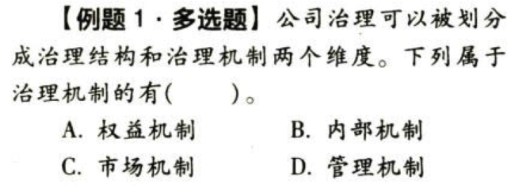

【答案】
[查看解析和答案](media/a6f63a16be49751d71afb271a3bb57c4.png.md)
# 2. 题目

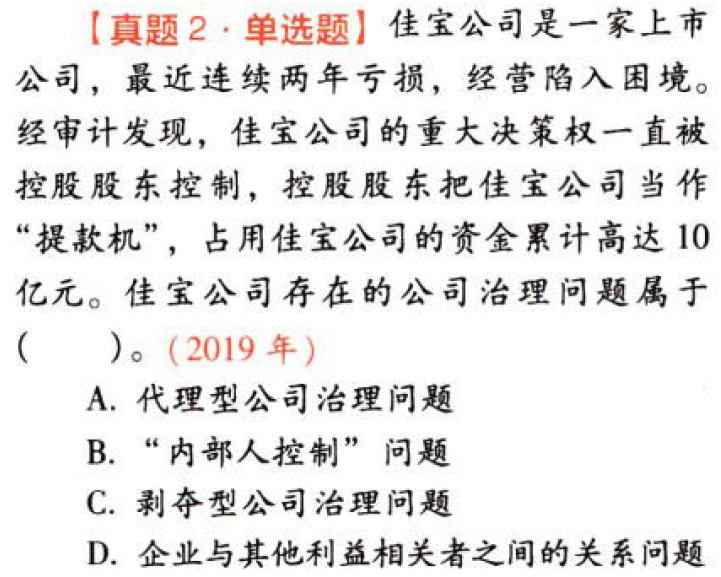

【答案】
[查看解析和答案](media/9633e5820c6dae180d37139fb097b6cf.png.md)
# 3. 题目

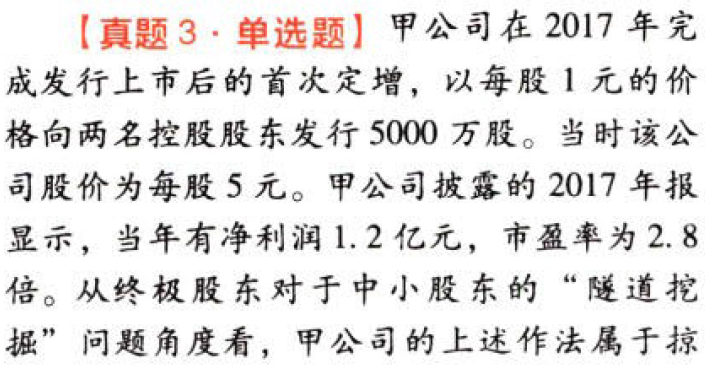

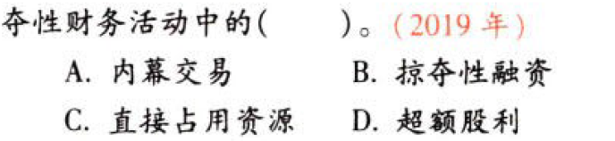

【答案】
[查看解析和答案](media/63762ac08bf2389b39ade212a4374275.png.md)
# 4. 题目

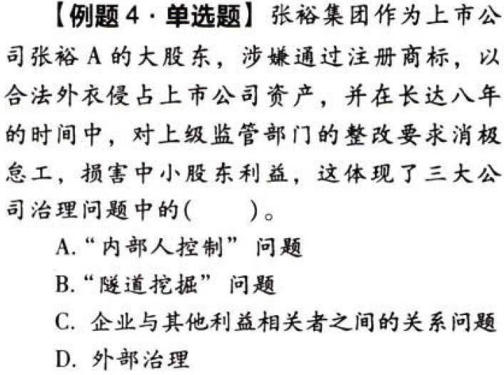

【答案】
[查看解析和答案](media/66cac7704db97bf5e81bb0e98029af80.png.md)
# 5. 题目

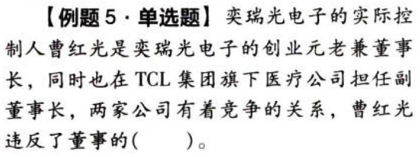

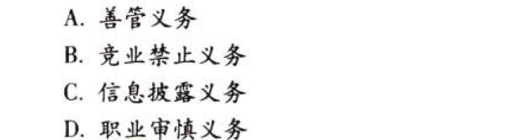

【答案】
[查看解析和答案](media/0bee49be491e5bf8e72234c519840de7.png.md)
# 6. 题目

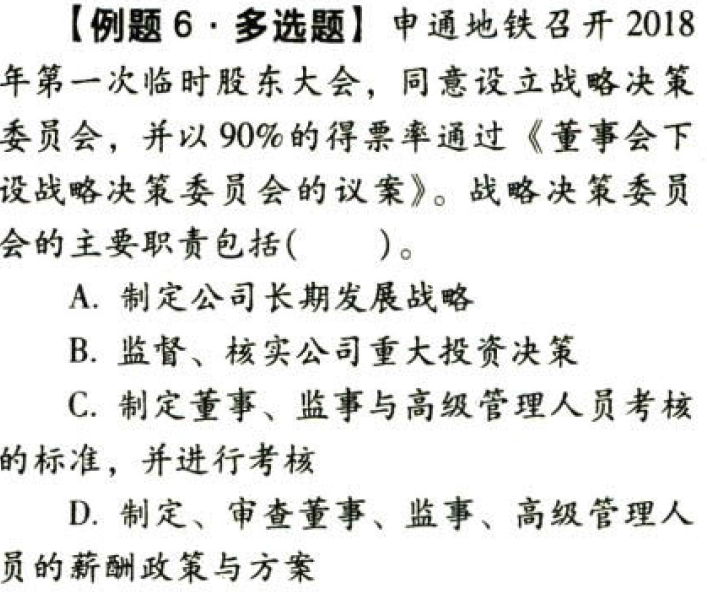

【答案】
[查看解析和答案](media/0b97a53c31d2c2e763cc703737f8adf9.png.md)
# 7. 题目

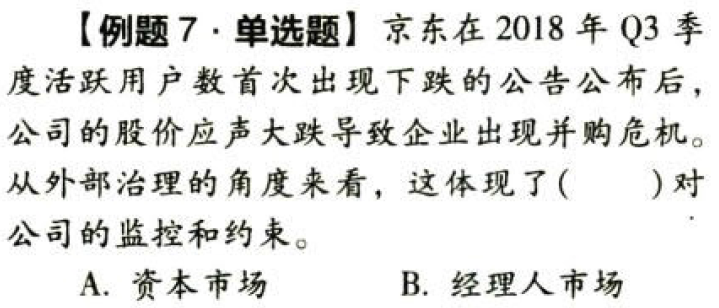

【答案】
[查看解析和答案](media/802babecfb434b676b4bef5bdef65908.png.md)
# 8. 题目

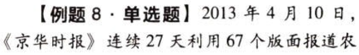

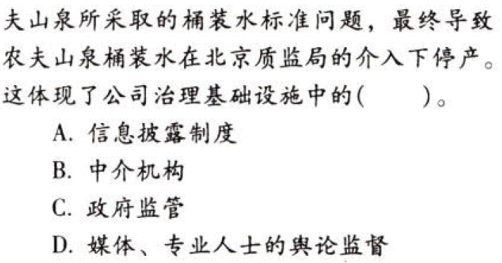

【答案】
[查看解析和答案](media/eb7d98cce2bc483f27622a4eea36b9ba.png.md)

