战略与战略管理

# 1. 题目

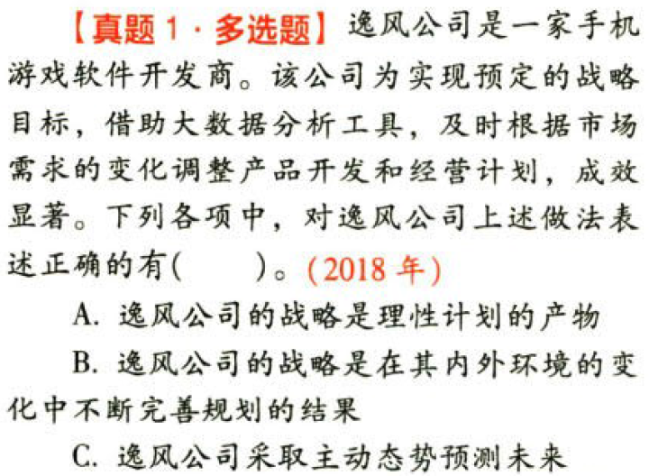

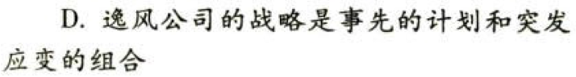

【答案】
[查看解析和答案](media/9f2adeecc8df0bd53694095077fa83b5.png.md)
# 2. 题目

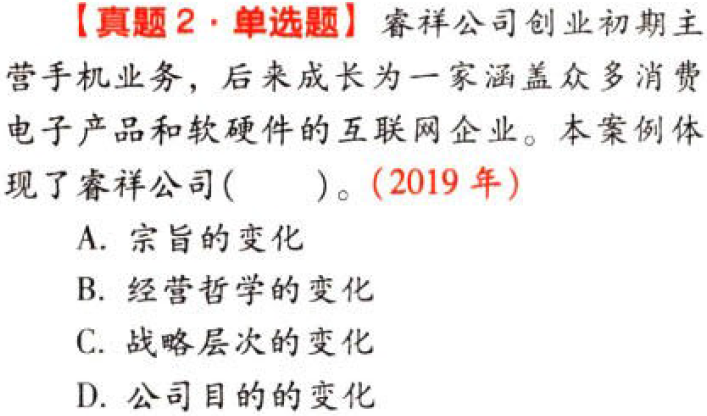

【答案】
[查看解析和答案](media/fa685e1d65156c29d612744c9aae3804.png.md)
# 3. 题目

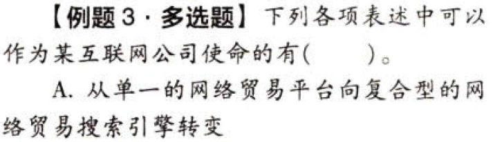

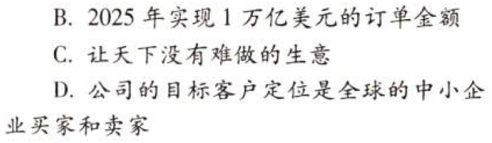

【答案】
[查看解析和答案](media/6285452d3dd02f41fae0077409c70932.png.md)
# 4. 题目

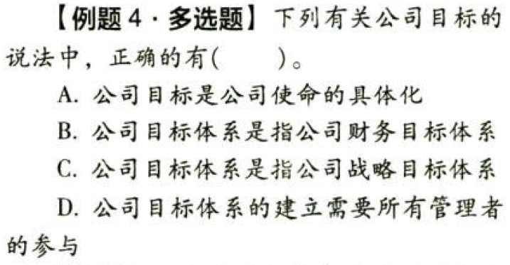

【答案】
[查看解析和答案](media/936f678f019c875e696cbffe7381e7df.png.md)
# 5. 题目

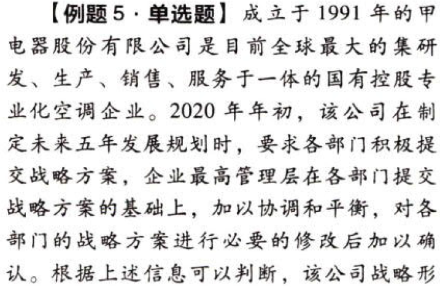

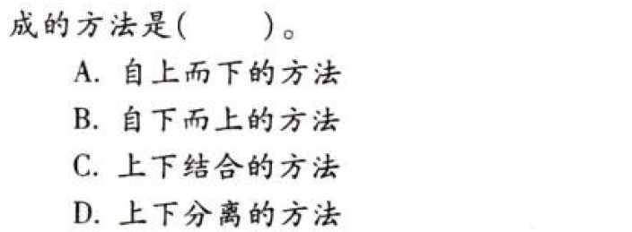

【答案】
[查看解析和答案](media/db14c53f7110a9f9bcaf520f565cdf05.png.md)
# 6. 题目

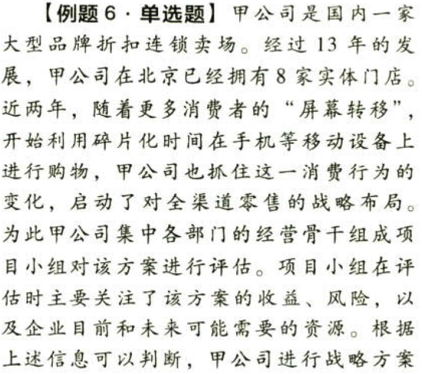

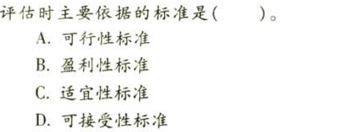

【答案】
[查看解析和答案](media/e8f60bf63f68348b783c6c03932b4a75.png.md)
# 7. 题目

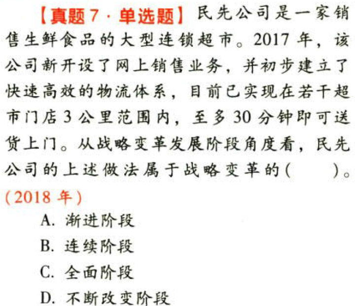

【答案】
[查看解析和答案](media/73e9efade5927e508b0f40eeb8153489.png.md)
# 8. 题目

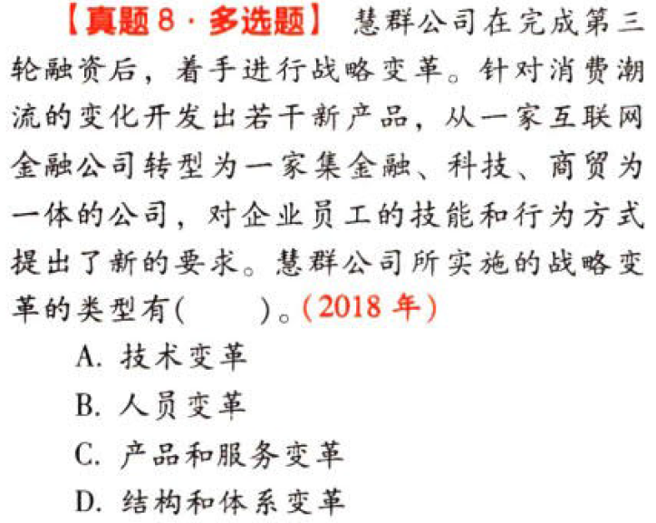

【答案】
[查看解析和答案](media/77d7a9f48ff4db31123db2f366108390.png.md)
# 9. 题目

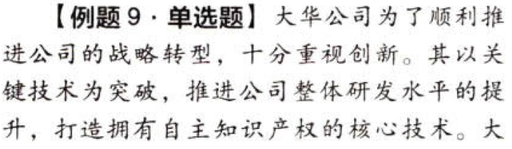

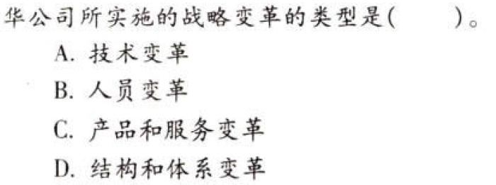

【答案】
[查看解析和答案](media/1005ce9300f60d606eaa9d51f8aefb41.png.md)
# 10. 题目

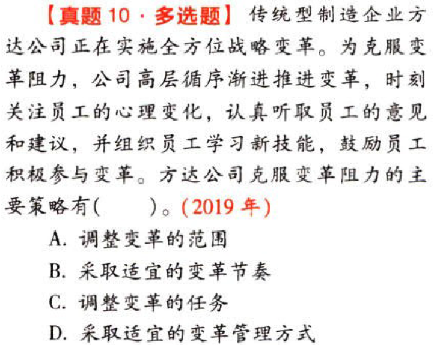

【答案】
[查看解析和答案](media/330e8737d2491fdd78d78d2cc6420c37.png.md)
# 11. 题目

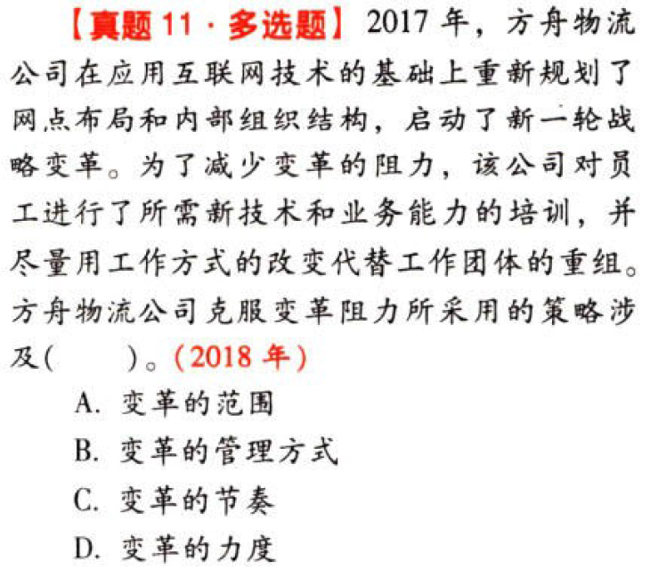

【答案】
[查看解析和答案](media/7fefe187ac16cc539e22d506169a8ddf.png.md)
# 12. 题目

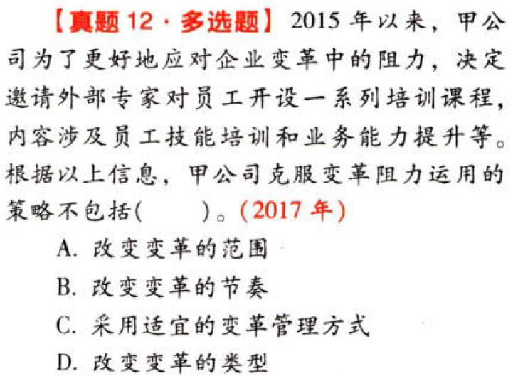

【答案】
[查看解析和答案](media/cdfb1a31c2e03927859be77a6e95743f.png.md)

