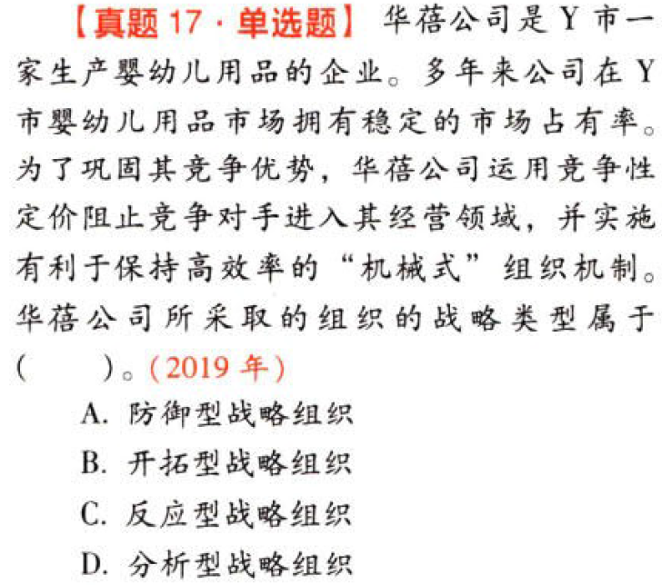
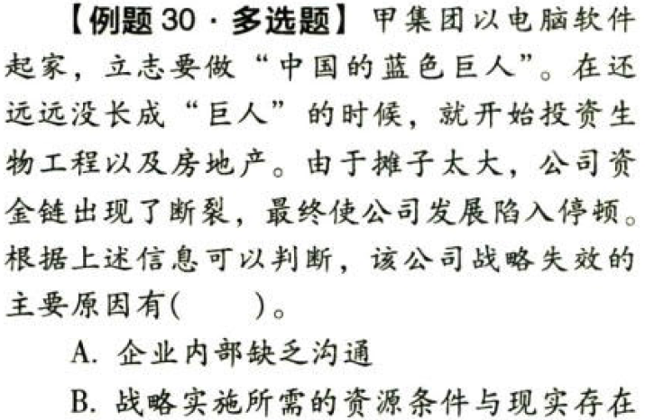
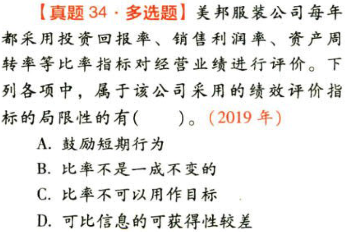

战略实施

# 1. 题目

【答案】
[查看解析和答案](media/8a3109895b554a5e5e37c426052d9cb3.png.md)
# 2. 题目

【答案】
[查看解析和答案](media/38bd8ea8d6c2434c3def1ffcf26dc4bc.png.md)
# 3. 题目

【答案】
[查看解析和答案](media/f58cc489949f84fa2a9ecf9aefe861cd.png.md)
# 4. 题目

【答案】
[查看解析和答案](media/9029cda3487b58b59b23e42c9a0b57ed.png.md)
# 5. 题目

【答案】
[查看解析和答案](media/bd383096b675be58da6584ffdf6165fb.png.md)
# 6. 题目

【答案】
[查看解析和答案](media/cd310da6556f5e6d4704c1c335a8fe29.png.md)
# 7. 题目

【答案】
[查看解析和答案](media/8dc47f01b95bddc71d76ae4bb3c4d0cd.png.md)
# 8. 题目

【答案】
[查看解析和答案](media/ab9f054a9d74b9312c96e0ccf0dbc02d.png.md)
# 9. 题目

【答案】
[查看解析和答案](media/058affcabb5aa9d4a4858f78480ec3a9.png.md)
# 10. 题目

【答案】
[查看解析和答案](media/9e814d07eefc691dfb631fb3ae09ed7d.png.md)
# 11. 题目

【答案】
[查看解析和答案](media/ae0d6d1d0c405886048e7eef75b00aaf.png.md)
# 12. 题目

【答案】
[查看解析和答案](media/29ff43bfbfecf70b0b283177f5e19e01.png.md)
# 13. 题目

【答案】
[查看解析和答案](media/5b6b3c5835369a3614941580355a17f4.png.md)
# 14. 题目

【答案】
[查看解析和答案](media/617b8b313e51b462574c92047776ae5e.png.md)
# 15. 题目

【答案】
[查看解析和答案](media/c7cf22234b77a2e546a3a00697d26bdd.png.md)
# 16. 题目

【答案】
[查看解析和答案](media/ce0e69a3c8832c6441b20a2e8f11fdc9.png.md)
# 17. 题目

【答案】
[查看解析和答案](media/6b5ed131f36d7647f9f2d1944cb10dcc.png.md)
# 18. 题目

【答案】
[查看解析和答案](media/3c4c6c3c30eb17b3b28e05791e326760.png.md)
# 19. 题目

【答案】
[查看解析和答案](media/24fe592262593a4b8593aaa26b6d3078.png.md)
# 20. 题目

【答案】
[查看解析和答案](media/99676e52ccdb3193aebb8d9b0d193237.png.md)
# 21. 题目

【答案】
[查看解析和答案](media/250792317f6d55dd7eb39aef2746ffeb.png.md)
# 22. 题目

【答案】
[查看解析和答案](media/e4d88b0532058529a204bc149e904a23.png.md)
# 23. 题目

【答案】
[查看解析和答案](media/67f6f673d896fb756e86d69e1b05824a.png.md)
# 24. 题目

【答案】
[查看解析和答案](media/1bde2aa57debd08f568a78ad0886e9f3.png.md)
# 25. 题目

【答案】
[查看解析和答案](media/d52e12557c32629d10ebd5c16a2a4249.png.md)
# 26. 题目

【答案】
[查看解析和答案](media/4311574fb1d9ba43856bb5988b8f62bb.png.md)
# 27. 题目

【答案】
[查看解析和答案](media/d5afa311281d0e4ddc546628d8d7818a.png.md)
# 28. 题目

【答案】
[查看解析和答案](media/e5439c4dfe0f23319017376c8c799db5.png.md)
# 29. 题目

【答案】
[查看解析和答案](media/0f06f12f34cd454c9fb0f7069e10a3ac.png.md)
# 30. 题目

【答案】
[查看解析和答案](media/67c1cd799d4c8e6faa336facd8506f34.png.md)
# 31. 题目

【答案】
[查看解析和答案](media/85bb3d5cb9ec17ebfcf41a54e2b061e9.png.md)
# 32. 题目

【答案】
[查看解析和答案](media/9edcf63478021570e2acdfb0d04bdf21.png.md)
# 33. 题目

【答案】
[查看解析和答案](media/6c9fe0232518ce2896c66fe6e4efcd4f.png.md)
# 34. 题目

【答案】
[查看解析和答案](media/7b416da2b604724e220af97cf4600ca6.png.md)
# 35. 题目

【答案】
[查看解析和答案](media/c7ba9ef40d95f647c3dc19476bb87407.png.md)
# 36. 题目

【答案】
[查看解析和答案](media/bdd86ebe0c85cd12ec29af7d02317c5c.png.md)
# 37. 题目

【答案】
[查看解析和答案](media/7195a0c467e2c3427e2eff9947345379.png.md)
# 38. 题目

【答案】
[查看解析和答案](media/a6fc776fa1a49e9e0a7056002dc3fab4.png.md)
# 39. 题目

【答案】
[查看解析和答案](media/ed746726a15f367b7a9d7f6dc9741bb3.png.md)
# 40. 题目

【答案】
[查看解析和答案](media/5994a4d438cfe61e2c3706dbba4588ed.png.md)
# 41. 题目

【答案】
[查看解析和答案](media/c500f18d9146964a672b4efe3ec727b4.png.md)
# 42. 题目

【答案】
[查看解析和答案](media/ce1b6b00547420a8193da34fcba1d9e2.png.md)
# 43. 题目

【答案】
[查看解析和答案](media/6cb1b7dc1cc3ada51eed91f24dcab104.png.md)
# 44. 题目

【答案】
[查看解析和答案](media/9a774875a363a79455c088edb02e6523.png.md)
# 45. 题目

【答案】
[查看解析和答案](media/3198537e3d0fb6b1cdaf8bba06622604.png.md)
# 46. 题目

【答案】
[查看解析和答案](media/fb2a1c10e7349e4ce882226990489088.png.md)
# 47. 题目

【答案】
[查看解析和答案](media/94113f620ca716edf163bb48fda2a122.png.md)
# 48. 题目

【答案】
[查看解析和答案](media/88cbeb9004436d54d8446cd73bee88eb.png.md)
# 49. 题目

【答案】
[查看解析和答案](media/22497c23200d28eb869aa5a23ab3a4e3.png.md)

