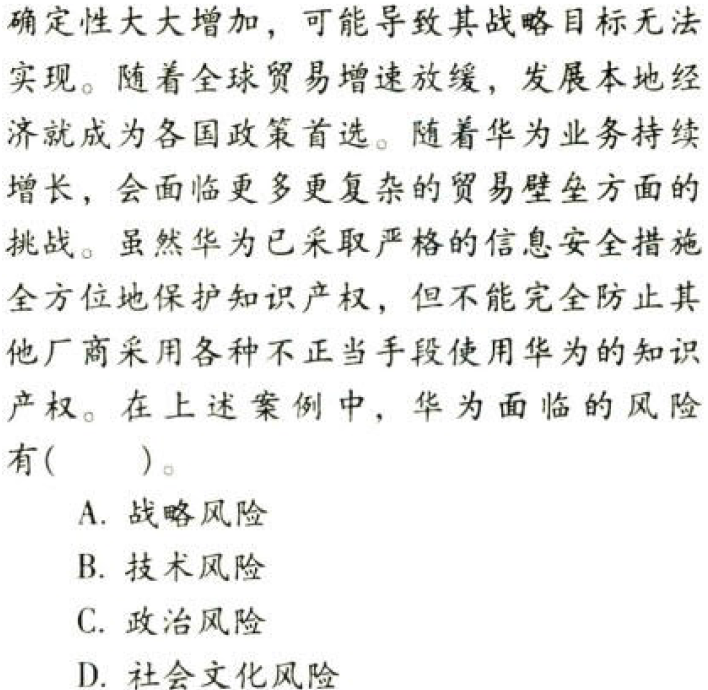
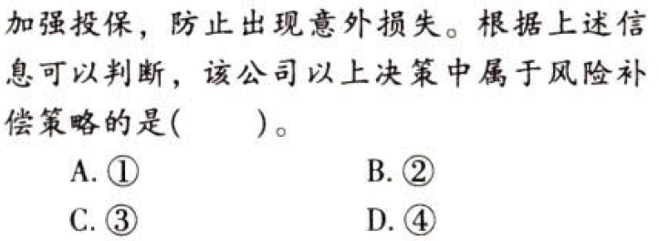
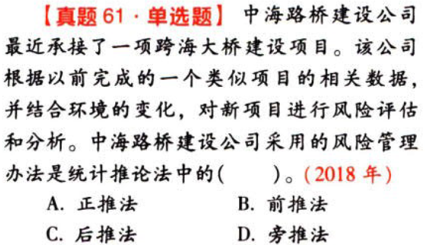

风险与风险管理

# 1. 题目

【答案】
[查看解析和答案](media/62939f6a9b1a88284c38e83295697a91.png.md)
# 2. 题目

【答案】
[查看解析和答案](media/6f15e59d43d5dd7d670fc82b99bf8671.png.md)
# 3. 题目

【答案】
[查看解析和答案](media/7ca4d9159b478c124fd3e582b9e0993e.png.md)
# 4. 题目

【答案】
[查看解析和答案](media/a465e970d1fa1e7a72855ccf7d9137f9.png.md)
# 5. 题目

【答案】
[查看解析和答案](media/2b3a1a2a622680760a21fab0687ca4bb.png.md)
# 6. 题目

【答案】
[查看解析和答案](media/9d05479cf836a470a786d6b15cd70de1.png.md)
# 7. 题目

【答案】
[查看解析和答案](media/7f6e88658ae5c86e4fd2668b53ca0430.png.md)
# 8. 题目

【答案】
[查看解析和答案](media/22d8ac2e8dc211a07766587bebe5d2d2.png.md)
# 9. 题目

【答案】
[查看解析和答案](media/b6f50ee278fa3fb7f5666ef9dd0376a6.png.md)
# 10. 题目

【答案】
[查看解析和答案](media/283da554a8958e329dac6eeca82e0cdc.png.md)
# 11. 题目

【答案】
[查看解析和答案](media/fb4c3c7d6a28c57202b8a07979c002f3.png.md)
# 12. 题目

【答案】
[查看解析和答案](media/9d2fe91d43c5d29a54400bfcb74a2365.png.md)
# 13. 题目

【答案】
[查看解析和答案](media/a048024d0ef462e9af7d7ef38951098e.png.md)
# 14. 题目

【答案】
[查看解析和答案](media/4cbb85a1c5bb1d48ec4bcd13513e7ce1.png.md)
# 15. 题目

【答案】
[查看解析和答案](media/3846f9e548e061209d01888079c1de5a.png.md)
# 16. 题目

【答案】
[查看解析和答案](media/7a290fcdf0813a595c09e779172d8981.png.md)
# 17. 题目

【答案】
[查看解析和答案](media/4c180e66f98a5ec6da6ef33e0819d4d6.png.md)
# 18. 题目

【答案】
[查看解析和答案](media/af65330a3f8f80b3b8f36fd3133dc6ff.png.md)
# 19. 题目

【答案】
[查看解析和答案](media/231329ddbe8f057f5c64e3da19c99cb1.png.md)
# 20. 题目

【答案】
[查看解析和答案](media/6c595105dc9a1e15537300400f26d70f.png.md)
# 21. 题目

【答案】
[查看解析和答案](media/d480f1ee6221519b69250ef82547f578.png.md)
# 22. 题目

【答案】
[查看解析和答案](media/b0a3a6865a5db743f17b309fd4ed9810.png.md)
# 23. 题目

【答案】
[查看解析和答案](media/8725720d5ffbf55fb2f5abbab82daac5.png.md)
# 24. 题目

【答案】
[查看解析和答案](media/82056a7c1ea13f333227884d9a51ffcf.png.md)
# 25. 题目

【答案】
[查看解析和答案](media/166881c1717b312a4d9696026d86bb0c.png.md)
# 26. 题目

【答案】
[查看解析和答案](media/b253886cd60829997b8c6f1f2ee89343.png.md)
# 27. 题目

【答案】
[查看解析和答案](media/2e6e5edd32cbc3f224916e702ee412c3.png.md)
# 28. 题目

【答案】
[查看解析和答案](media/7f2d7f251a88eaa6f11ec6e6afa101cd.png.md)
# 29. 题目

【答案】
[查看解析和答案](media/573eca893e6f143a40e022e7c1edf8c5.png.md)
# 30. 题目

【答案】
[查看解析和答案](media/e59cc2f7ea943cdeb61b7467ebd7f987.png.md)
# 31. 题目

【答案】
[查看解析和答案](media/1a788a3907245b4924e755c821139f25.png.md)
# 32. 题目

【答案】
[查看解析和答案](media/e85c35af08903989b409e4095061a9ad.png.md)
# 33. 题目

【答案】
[查看解析和答案](media/4d578a40e6d34beda9dd82eedf8e65cb.png.md)
# 34. 题目

【答案】
[查看解析和答案](media/bfe2ef6f945cf02090fa531902cc8cb7.png.md)
# 35. 题目

【答案】
[查看解析和答案](media/52b332504719043602677a4e10cdbc29.png.md)
# 36. 题目

【答案】
[查看解析和答案](media/4ff95e8bc91b2c9b5541cc45da683282.png.md)
# 37. 题目

【答案】
[查看解析和答案](media/19d1af7f52fc97f07ba85c4f9c086dec.png.md)
# 38. 题目

【答案】
[查看解析和答案](media/5c6000973b318480374c03cfda34ceae.png.md)
# 39. 题目

【答案】
[查看解析和答案](media/58396f1404380e4f666d7da99e368d4f.png.md)
# 40. 题目

【答案】
[查看解析和答案](media/3f505189cbb27c0771592b2208021d2e.png.md)
# 41. 题目

【答案】
[查看解析和答案](media/b64fd00dc8ff1098361127b286d8b3b6.png.md)
# 42. 题目

【答案】
[查看解析和答案](media/9628278bd924bc2fe0c6c5c1c5f25285.png.md)
# 43. 题目

【答案】
[查看解析和答案](media/c662e9aabca5f95b40a95d4be7cbe11f.png.md)
# 44. 题目

【答案】
[查看解析和答案](media/8f23742e25b8f86787c319e8e07fed49.png.md)
# 45. 题目

【答案】
[查看解析和答案](media/7fb2e1995c24883bde75242bf8cfd839.png.md)
# 46. 题目

【答案】
[查看解析和答案](media/1dc2660235444e60f1f10d79e1b9982c.png.md)
# 47.  题目

【答案】
[查看解析和答案](media/e1d9ae69aa2989958c10dd07ea680362.png.md)
# 48. 题目

【答案】
[查看解析和答案](media/973d63dcc0c5ddde78dd3468912e91ee.png.md)
# 49. 题目

【答案】
[查看解析和答案](media/1130ad7f1632147495a2eb502174628e.png.md)
# 50. 题目

【答案】
[查看解析和答案](media/678cfaa2feeee4563d7a915e584d3eb8.png.md)
# 51. 题目

【答案】
[查看解析和答案](media/061442a546b80299dbdc03dce11f9bfe.png.md)
# 52. 题目

【答案】
[查看解析和答案](media/3e35b1c07216862e2ba41d84af6675ce.png.md)
# 53. 题目

【答案】
[查看解析和答案](media/bbf4ae2eb7b9a4a4223a71898993739c.png.md)
# 54. 题目

【答案】
[查看解析和答案](media/4ecd5b960536f75470916b5d84b0067c.png.md)
# 55. 题目

【答案】
[查看解析和答案](media/6763ca8713e555851a834496c8f9ca5b.png.md)
# 56. 题目

【答案】
[查看解析和答案](media/3b3c4d7eba2d6b8bebd39c8dd50f33ec.png.md)
# 57. 题目

【答案】
[查看解析和答案](media/2e2dcb961be6f085f512c2963289dd9c.png.md)
# 58. 题目

【答案】
[查看解析和答案](media/a2f557c2f5bb446f506b2f029104e6f9.png.md)
# 59. 题目

【答案】
[查看解析和答案](media/03ad6e58f2a58b551ace67a8b326cf71.png.md)
# 60. 题目

【答案】
[查看解析和答案](media/7bb563e7440d0cce9787e21cce709ac0.png.md)
# 61. 题目

【答案】
[查看解析和答案](media/56cb620184e96ceef578d9109f35ebd8.png.md)
# 62. 题目

【答案】
[查看解析和答案](media/1dc6dc88d23b0459d61f1937a927c1c5.png.md)
# 63. 题目

【答案】
[查看解析和答案](media/05f5762445af36c3cac94489a293696f.png.md)
# 64. 题目

【答案】
[查看解析和答案](media/d20c3eccdbf07fef8e2f1183d6d7b1d0.png.md)
# 65. 题目

【答案】
[查看解析和答案](media/70e6d9aa2e8c2cf131b49081b04202e3.png.md)
# 66. 题目

【答案】
[查看解析和答案](media/c68ca5815a2c1c85c1bf4da3408cefaa.png.md)
# 67. 题目

【答案】
[查看解析和答案](media/ae8756c09bde7e32feef751f113995db.png.md)
# 68. 题目

【答案】
[查看解析和答案](media/7ca29006d29801c0d202566631dc7510.png.md)
# 69. 题目

【答案】
[查看解析和答案](media/99ee8ecc8692e4945986bdb02fe018f5.png.md)
# 70. 题目

【答案】
[查看解析和答案](media/29006b8e73d7057c0f11fd1d83242860.png.md)

